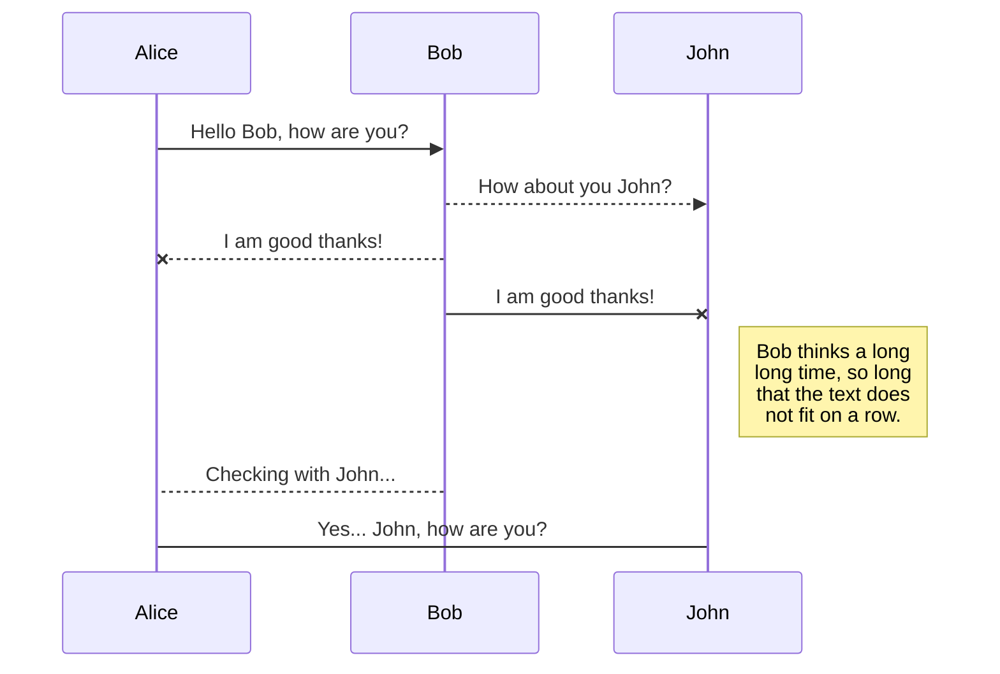
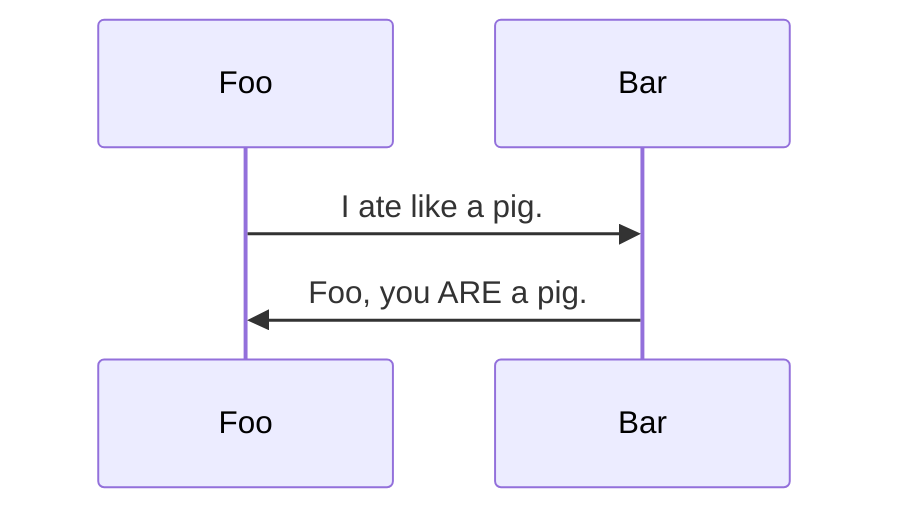

# test
- a
	- and
	- be
- b

# math

## Euler's Identity

In mathematics, **Euler's identity** is the equality
$$ e^{i \pi} + 1 = 0. $$

### Explanation

Euler's identity is a special case of Euler's formula from complex
analysis, which states that for any real number $ x $,
$$ e^{ix} = \cos x + i \sin x. $$

# Diagram

- ex01

- ex02

