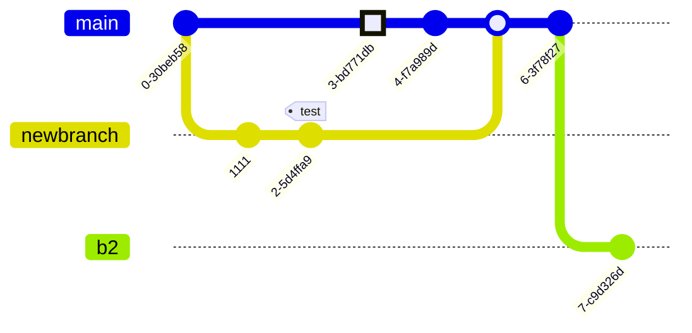

# Features gh
## ✅ Lists
- [✔] [symbl](https://symbl.cc/)
- [☑] Item 1
- [❌] Item 2
  - [❎] Subitem

## ✅ Tables ❎

| Name       | Age | City      |
|------------|-----|-----------|
| Alice      | 30  | New York  |
| Bob        | 25  | Los Angeles|
| Charlie    | 35  | Chicago   |

## List

- [x] Write the press release
- [ ] Update the website
- [ ] Contact the media

## Diagram

- ex01


- ex02


- ex03


- ex 04


- ex 05



- ex 06


- ex 07
	- [fontawesome v4 icons](https://fontawesome.com/v4/icons/)


## ✅ Code Block

```js
console.log("Hello from JS");
alert( 'Hello, world!' );
```

## ✅ Math

Inline math: $\gamma = \frac{1}{\sqrt{1 - v^2/c^2}}$

Block math:

more
$$
\exists x \forall y (Rxy \equiv Ryx)
$$

$v(t) = v_0 + \frac{1}{2}at^2$

$\gamma = \dfrac{1}{\sqrt{1 - v^2/c^2}}$  

$\exists x \forall y (Rxy \equiv Ryx)$

$p \wedge q \models p$

$\Box\diamond p\equiv\diamond p$

$\int_{0}^{1} x dx = \left[\dfrac{1}{2}x^2\right]_{0}^{1} = \dfrac{1}{2}$

$e^x = \sum\limits_{n=0}^\infty \dfrac{x^n}{n!} = \lim_{n\rightarrow\infty} (1+x/n)^n$
