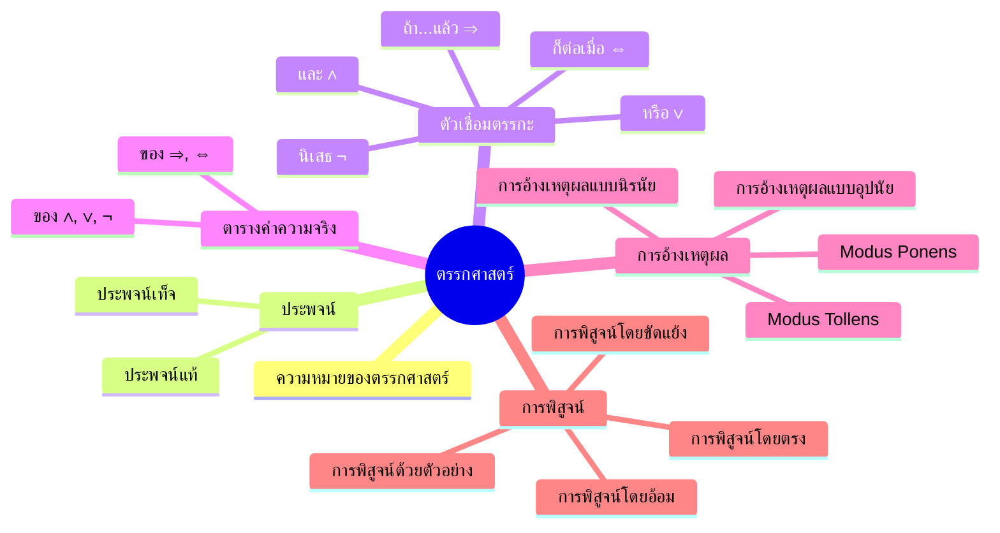
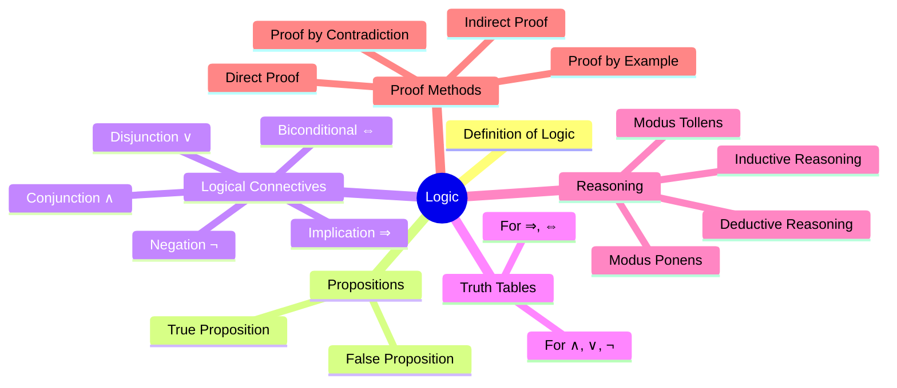
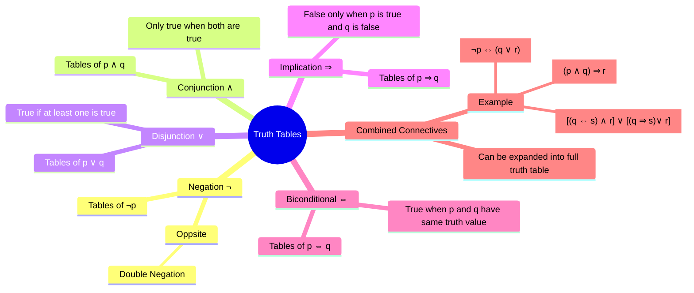

# Concept : ตรรกศาสตร์ (Logic)

## ประเด็น
- ความหมายของตรรกศาสตร์
- ประพจน์
- ตัวเชื่อมตรรกะ
- การวิเคราะห์ค่าความจริง
- ตารางค่าความจริง
- การอ้างเหตุผล
- การพิสูจน์

---

## Mind Map (Th)

---

## Mind Map (En)

---

## Truth Tables

