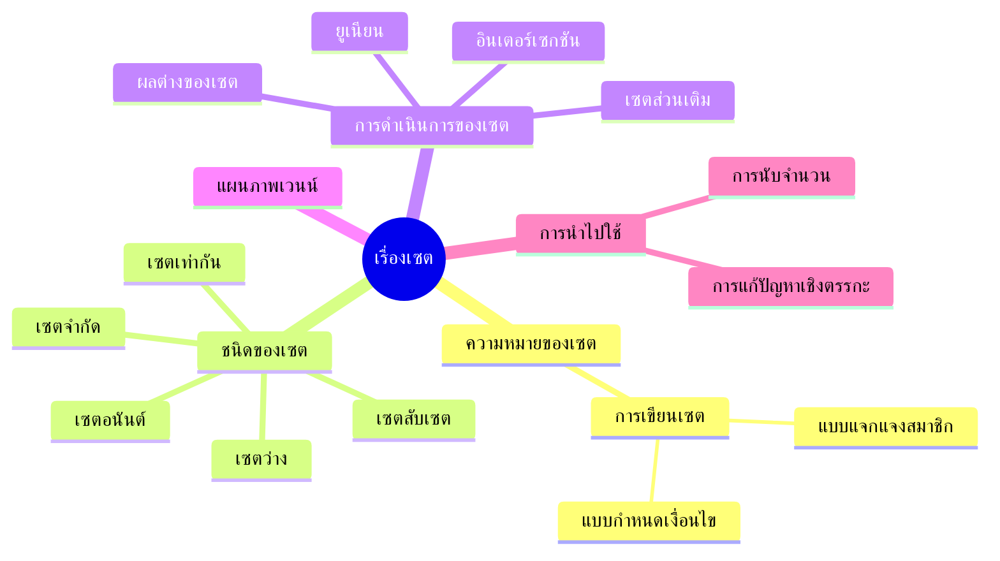

# Concept : เรื่องเซต

## ความหมายของเซต
- คำจำกัดความ: เซตคือกลุ่มของวัตถุที่กำหนดชัดเจน
- การเขียนเซต:
  - แบบแจกแจงสมาชิก: $\{1, 2, 3\}$
  - แบบกำหนดเงื่อนไข: $\{x \mid x \in \mathbb{N},\ x < 5\}$

## ชนิดของเซต
- เซตว่าง: $\varnothing$
- เซตจำกัด
- เซตอนันต์
- เซตเท่ากัน: $A = B$
- เซตสับเซต: $A \subseteq B$

## การดำเนินการของเซต
- ยูเนียน (Union): $A \cup B$
- อินเตอร์เซกชัน (Intersection): $A \cap B$
- ผลต่างของเซต: $A - B$
- เซตส่วนเติม: $A^{\complement}$ หรือ $\overline{A}$

## แผนภาพเวนน์
- ใช้แสดงความสัมพันธ์ระหว่างเซต

## การนำไปใช้
- การแก้ปัญหาเชิงตรรกะ
- การนับจำนวน (เช่น การนับแบบไม่ซ้ำกัน)

---

## Mind Map

