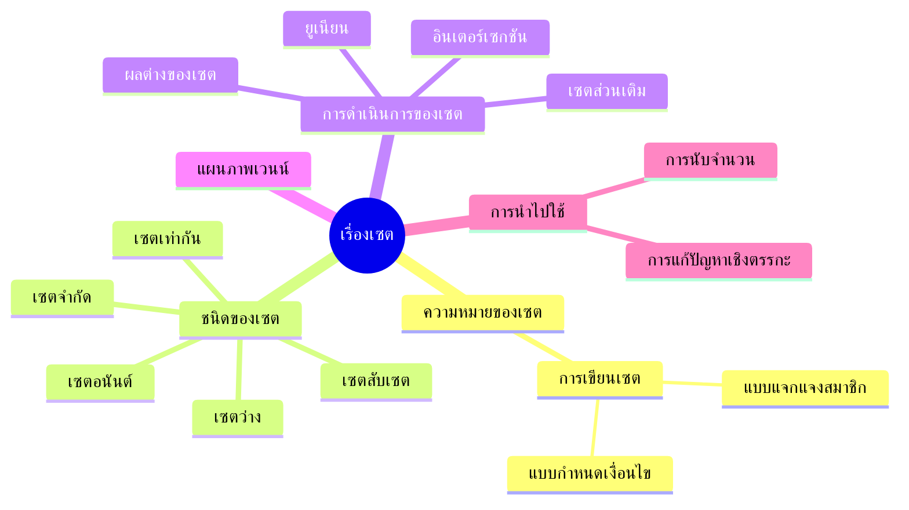
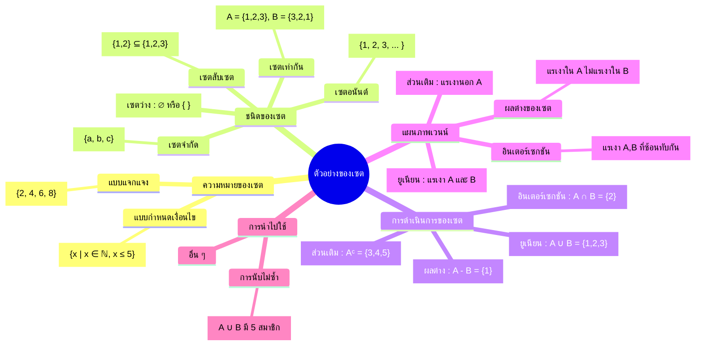

# Concept : เรื่องเซต

## ความหมายของเซต
- คำจำกัดความ : เซตคือกลุ่มของวัตถุที่กำหนดชัดเจน
- การเขียนเซต :
  - แบบแจกแจงสมาชิก : $\\{1, 2, 3\\}$
  - แบบกำหนดเงื่อนไข : $\\{x \mid x \in \mathbb{N},\ x < 5 \\}$

## ชนิดของเซต
- เซตว่าง : $\varnothing$ หรือ $\\{ \ \\}$
- เซตจำกัด
- เซตอนันต์
- เซตเท่ากัน : $A = B$
- เซตสับเซต : $A \subseteq B$

## การดำเนินการของเซต
- ยูเนียน (Union) : $A \cup B$
- อินเตอร์เซกชัน (Intersection) : $A \cap B$
- ผลต่างของเซต : $A - B$
- เซตส่วนเติม : $A^{\complement}$ หรือ $\overline{A}$ หรือ $A^{\prime}$

## แผนภาพเวนน์
- ใช้แสดงความสัมพันธ์ระหว่างเซต

## การนำไปใช้
- การแก้ปัญหาเชิงตรรกะ
- การนับจำนวน (เช่น การนับแบบไม่ซ้ำกัน)

---

## Mind Map

---

# ตัวอย่าง : เรื่องเซต

## ตัวอย่าง : ความหมายของเซต
- ตัวอย่างแบบแจกแจงสมาชิก : $\\{2, 4, 6, 8\\}$
- ตัวอย่างแบบกำหนดเงื่อนไข : $\\{x \mid x \in \mathbb{N},\ x \leq 5\\}$

## ตัวอย่าง : ชนิดของเซต
- เซตว่าง : $\\varnothing$ หรือ $\\{    \\}$
- เซตจำกัด : $\\{a, b, c\\}$
- เซตอนันต์ : $\\{1, 2, 3, \dots  \\}$
- เซตเท่ากัน : ถ้า $A = \\{1, 2, 3\\}$ และ $B = \\{3, 2, 1\\} \Rightarrow A = B$
- เซตสับเซต : $\\{1, 2 \\} \subseteq \\{1, 2, 3\\}$

## ตัวอย่าง : การดำเนินการของเซต
- ยูเนียน : $A = \\{1, 2\\}, B = \\{2, 3\\} \Rightarrow A \cup B = \\{1, 2, 3\\}$
- อินเตอร์เซกชัน : $A \cap B = \\{2\\}$
- ผลต่างของเซต : $A - B = \\{1\\}$
- ส่วนเติม : ถ้า $U = \\{1,2,3,4,5\\}, A = \\{1,2\\} \Rightarrow A^{\complement} = \\{3,4,5\\}$

## ตัวอย่าง : แผนภาพเวนน์
- แสดง $A \cup B$ : แรเงาพื้นที่ทั้งสองวงกลม
- แสดง $A \cap B$ : แรเงาพื้นที่ที่สองวงกลมซ้อนทับกัน
- แสดง $A - B$ : แรเงาพื้นที่อยู่ใน $A$ แต่ไม่อยู่ใน  $B$ 
- แสดง $A^{\complement}$ : แรเงาพื้นที่ที่อยู่นอก $A$ 

## ตัวอย่าง : การนำไปใช้
- การนับสมาชิกไม่ซ้ำกัน เช่น :
  - $A = \\{1, 2, 3\\}, B = \\{3, 4, 5\\}$
  - สมาชิกไม่ซ้ำกันใน $A \cup B = \\{1, 2, 3, 4, 5\\} \Rightarrow$ มี $5$ สมาชิก

---

## Mindmap

---

# Venn diagram

